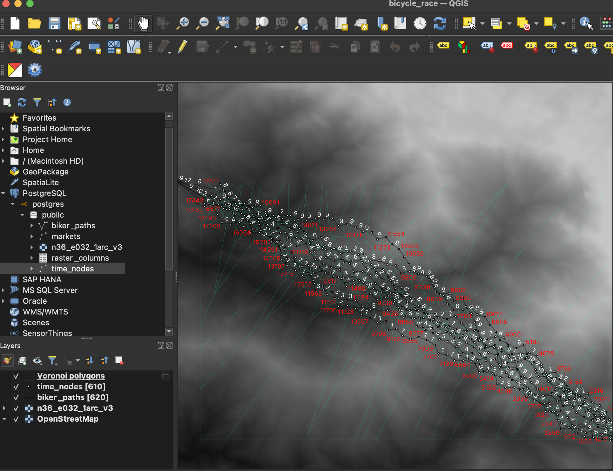

## Setup

qgis + postgis needs to be installed
Then clone this repo, create a virtual environment and activate it.

```bash
python3 -m venv venv
source venv/bin/activate
```

Then install the dependencies.

```bash

## Usage

How to use the project.

```bash
python3 random_paths_generator.py
```

Then open the QGIS project and load the generated paths from your postgres database.

## Screenshot
red text is for the total distance from start to the next point;
white text represents the biker id;
the green lines are voronoi polygons;
